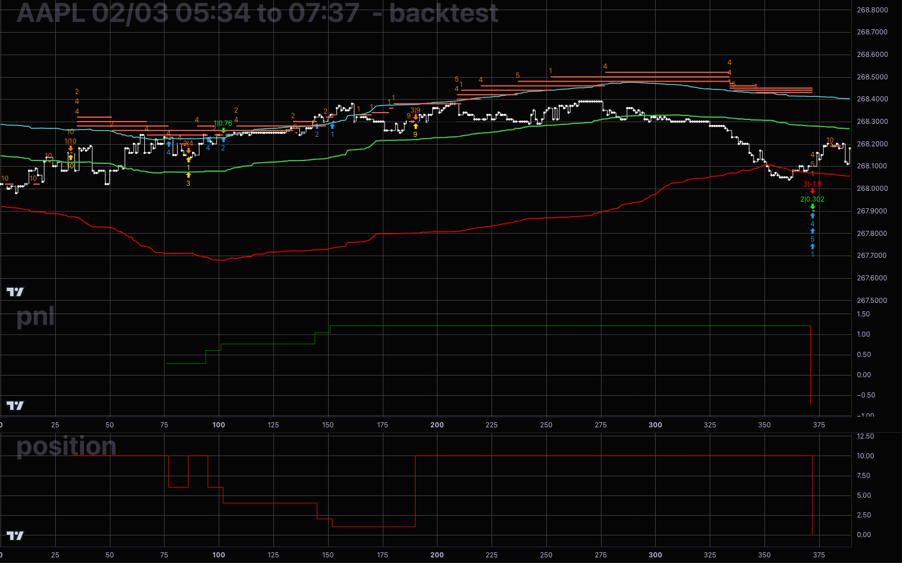

# backtest_plots

A React + Vite frontend for visualizing backtest results from a local trading-strategy backend. Renders tick price data, indicator lines, order fills, and signals on synchronized [lightweight-charts](https://github.com/tradingview/lightweight-charts) panes.



A fully interactive version of the chart above is checked in at [`tests/snapshots/expected.html`](tests/snapshots/expected.html). Download the raw file ([direct link](https://github.com/icanhazcodeplz/backtest-plots/raw/main/tests/snapshots/expected.html)) and open it in any browser — it's a self-contained bundle with the fixture data inlined, so no backend or build step is required to pan, zoom, and inspect the panes locally.

## What it shows

The app fetches a single JSON payload from `http://127.0.0.1:5001/api/data` and renders:

- **Main pane** — tick price line, with optional indicator overlays (`TickChartLines`), order durations drawn as horizontal segments colored by side (buy/sell), fill markers, vertical signal lines tagged with win/loss colors, arbitrary vertical time markers (`VertLines`), and horizontal price levels (`HorizLines`).
- **Sub-panes** — up to two additional panes (`TickChart2Lines`, `TickChart3Lines`) for indicators rendered below the main chart, with per-point coloring based on sign.
- **Watermarks** — the payload `title` on the main pane; indicator keys on each sub-pane.

All panes share a synchronized time scale and crosshair. The time axis uses an integer index internally so non-uniform tick timestamps render without gaps; tick `time` values (nanosecond strings) are formatted back to `HH:MM:SS.nnnnnnnnn` on the axis.

## Running

The frontend expects a backend serving `/api/data` on `127.0.0.1:5001`.

```
npm install
npm run dev
```

Other scripts:

- `npm run build` — production build
- `npm run preview` — preview the production build
- `npm run lint` — run ESLint

## API data schema

`GET http://127.0.0.1:5001/api/data` must return a JSON object with the following fields:

### Top-level

| Field | Type | Required | Description |
|---|---|---|---|
| `ticks` | `Tick[]` | yes | Ordered array of price ticks; drives all chart time axes |
| `fill_markers` | `FillMarker[]` | yes | Markers placed on the fill series |
| `TickChartLines` | `LineConfig[]` | no | Overlay lines on the main (price) pane |
| `TickChart2Lines` | `LineConfig[]` | no | Lines for the first sub-pane; renders only when at least one tick has the key |
| `TickChart3Lines` | `LineConfig[]` | no | Lines for the second sub-pane; same condition |
| `orderDurations` | `OrderDuration[]` | no | Horizontal segments showing open-order lifetimes |
| `signals` | `Signal[]` | no | Vertical lines marking strategy signals |
| `VertLines` | `VertLine[]` | no | Arbitrary vertical time markers on the main pane |
| `HorizLines` | `HorizLine[]` | no | Arbitrary horizontal price levels on the main pane |
| `title` | `string \| string[]` | no | Watermark text on the main pane |

### `Tick`

| Field | Type | Required | Description |
|---|---|---|---|
| `time` | `string` | yes | Nanosecond Unix timestamp as a decimal string, e.g. `"1770121507372223001"` |
| `price` | `number` | yes | Trade price; plotted as the main price line |
| `fill` | `number` | no | Fill price at this tick; plotted as a separate dot series for order fills |
| `size` | `number` | no | Trade size |
| *any indicator key* | `number` | no | Arbitrary numeric fields consumed by `TickChartLines`, `TickChart2Lines`, or `TickChart3Lines` via their `key` property |

### `LineConfig`

| Field | Type | Required | Description |
|---|---|---|---|
| `key` | `string` | yes | Field name to read from each `Tick` |
| `color` | `string` | yes | CSS color for the line (and positive values when `color_negative` is set) |
| `color_negative` | `string` | no | CSS color for ticks where the value is negative; required for `TickChart2Lines` / `TickChart3Lines` |
| `type` | `number` | yes | lightweight-charts `LineType`: `0` = Simple, `1` = WithSteps |
| `width` | `number` | yes | Line width in pixels |

### `FillMarker`

| Field | Type | Required | Description |
|---|---|---|---|
| `time` | `string` | yes | Nanosecond timestamp; must match an existing `Tick.time` |
| `price` | `number` | yes | Price level for the marker |
| `color` | `string` | yes | Marker color |
| `position` | `string` | yes | `"aboveBar"` or `"belowBar"` |
| `shape` | `string` | yes | `"circle"`, `"arrowUp"`, or `"arrowDown"` |
| `text` | `string` | yes | Label text shown on the marker |
| `size` | `number` | no | Marker size multiplier |

### `OrderDuration`

| Field | Type | Required | Description |
|---|---|---|---|
| `start_time` | `string` | yes | Nanosecond timestamp; must match an existing `Tick.time` |
| `end_time` | `string` | yes | Nanosecond timestamp; must match an existing `Tick.time` |
| `price` | `number` | yes | Price level at which the segment is drawn |
| `qty` | `number` | yes | Order quantity |
| `side` | `string` | yes | `"buy"` (yellow) or `"sell"` (red-orange) |

### `Signal`

| Field | Type | Required | Description |
|---|---|---|---|
| `time` | `string` | yes | Nanosecond timestamp; must match an existing `Tick.time` |
| `win` | `boolean` | yes | `true` = green vertical line, `false` = red |
| `tag` | `string` | yes | Label text shown at the top of the vertical line |

### `VertLine`

| Field | Type | Required | Description |
|---|---|---|---|
| `time` | `string` | yes | Nanosecond timestamp; snapped to the nearest `Tick.time`, so it need not match one exactly |
| `color` | `string` | no | CSS color for the line and its axis label (default `blue`) |
| `thickness` | `number` | no | Line width in pixels (default `1`) |
| `annotation` | `string` | no | Label text on the time axis; omit for no label |

### `HorizLine`

| Field | Type | Required | Description |
|---|---|---|---|
| `start_time` | `string` | yes | Nanosecond timestamp; must match an existing `Tick.time` |
| `end_time` | `string` | yes | Nanosecond timestamp; must match an existing `Tick.time` |
| `price` | `number` | yes | Price level at which the line is drawn |
| `color` | `string` | no | CSS color for the line and its annotation (default `blue`) |
| `thickness` | `number` | no | Line width in pixels (default `2`) |
| `annotation` | `string` | no | Label text drawn above the right-hand end of the line; omit for no label |

## Test data

A captured response from the local API is checked in at `tests/data/api_data.json` for reference and future integration tests.
